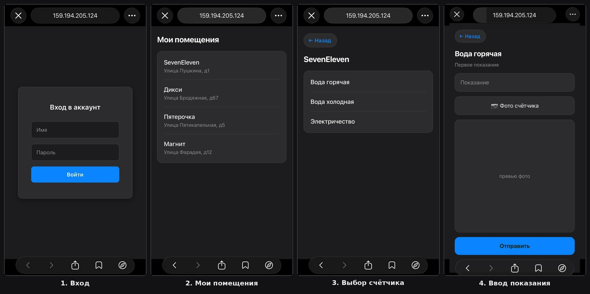
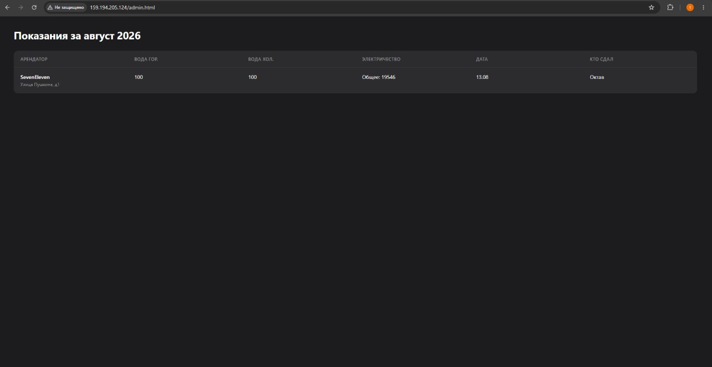

# Meter-Tracker

Веб-приложение для учёта показаний счётчиков коммунальных услуг. Разработано для управления несколькими арендуемыми помещениями — позволяет арендаторам подавать показания с телефона, а владельцу видеть сводную таблицу на компьютере.

## Скриншоты



**Admin-панель (компьютер)**



## Возможности

**Для арендаторов (телефон)**
- Вход по логину и паролю
- Список своих помещений
- Подача показаний счётчиков (электричество, горячая и холодная вода)
- Прикрепление фото счётчика к каждому показанию
- Валидация: новое показание не может быть меньше предыдущего

**Для владельца (компьютер)**
- Сводная таблица всех помещений с актуальными показаниями
- Просмотр кто и когда сдал показания
- Группировка по типу счётчика (вода горячая / холодная / электричество)

## Стек

**Бэкенд**
- ASP.NET Core Web API (.NET 10)
- Entity Framework Core + PostgreSQL
- Redis — кэширование часто запрашиваемых данных
- JWT-аутентификация с ролями (Admin / User)
- BCrypt для хеширования паролей
- Cloudinary для хранения фотографий

**Фронтенд**
- Vanilla HTML / CSS / JavaScript (без фреймворков)
- Адаптивный дизайн: мобильный интерфейс для арендаторов, десктопный для владельца
- SPA-подобная навигация между экранами

**Инфраструктура**
- Docker (multi-stage build), три независимых контейнера (API, PostgreSQL, Redis) в общей Docker-сети
- Nginx — отдача статики фронтенда отдельным контейнером
- Развёрнуто на VPS (Ubuntu 24.04), доступно по публичному IP

## Архитектура

**Frontend/** — `html/` (index, readings, admin) · `css/` · `js/`

**MeterTrackerApi/** — `Controllers/` (Auth, Meters, Premises, Readings) · `Services/` (MeterService, PremiseService, ReadingService, CloudinaryService) · `Models/` (User, Premise, Meter, Reading) · `DTOs/` · `Migrations/`

## Модель данных

- **User** — пользователь системы (Admin / User)
- **Premise** — помещение с адресом и арендатором
- **Meter** — счётчик в помещении (тип + тариф)
- **Reading** — показание счётчика (значение + фото + дата + кто сдал)

## Запуск локально

```bash
git clone https://github.com/tsepesh-stack/Meter-Tracker
cd MeterTrackerApi
dotnet ef database update
dotnet run
```

Фронтенд открывается через Live Server или любой статический сервер.

## Деплой

Проект развёрнут в контейнерах на VPS: API, PostgreSQL и Redis в изолированной Docker-сети, статика фронтенда отдаётся через отдельный контейнер Nginx. Секреты (JWT, строки подключения, ключи Cloudinary) передаются через переменные окружения, не хранятся в репозитории.

## Заметки

Проект разработан самостоятельно в процессе обучения backend-разработке на C#/.NET.
Для стилизации использован Claude Code (AI-ассистент).

---

*Первый коммерческий проект — реальное использование для управления арендой недвижимости.*